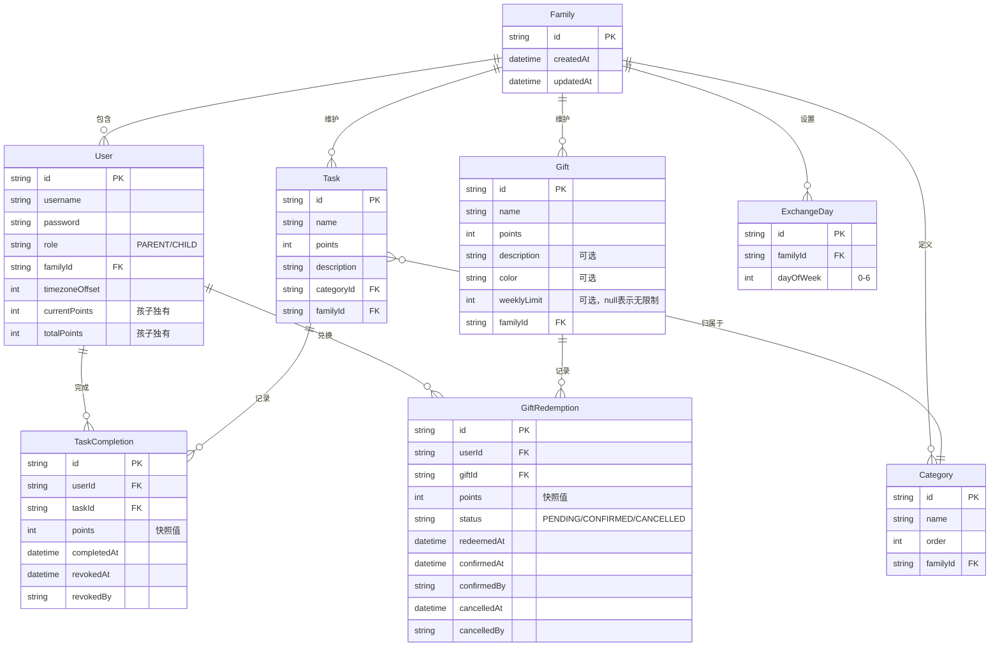
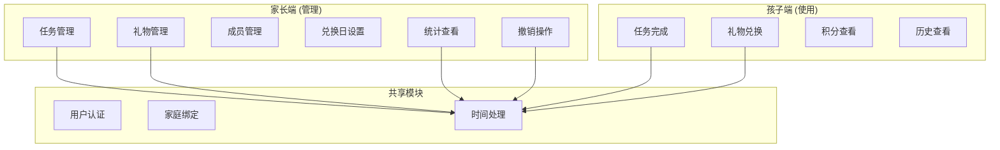
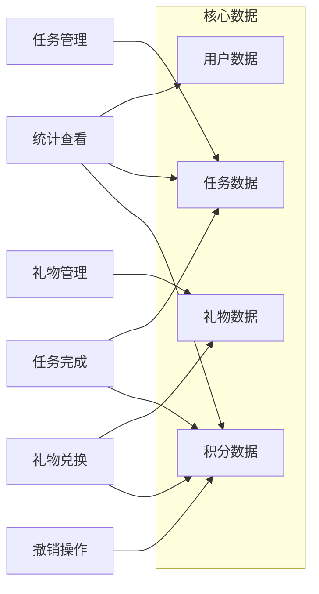
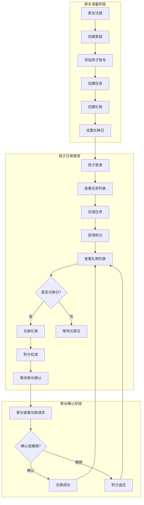
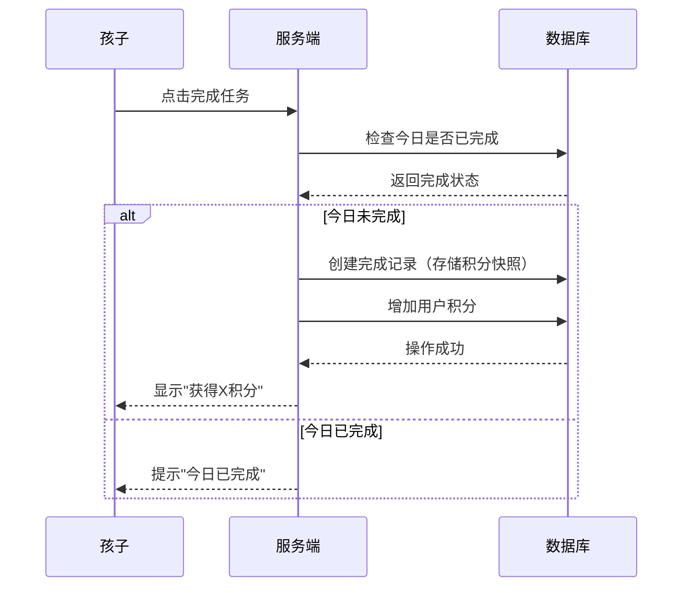
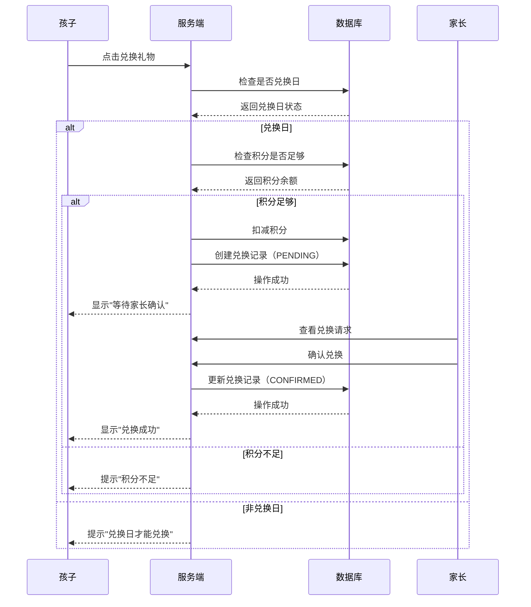
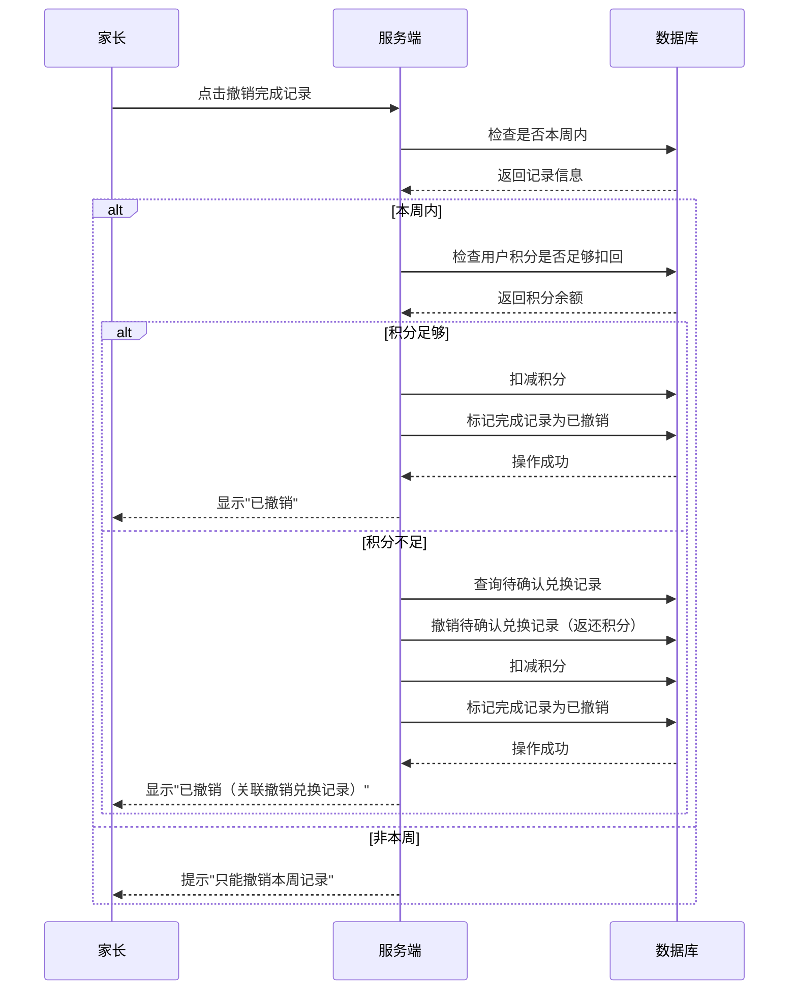
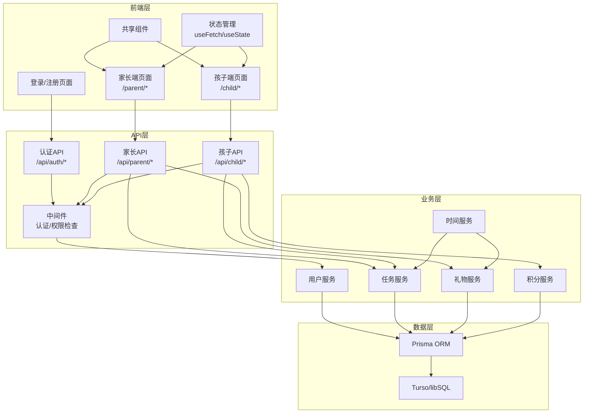
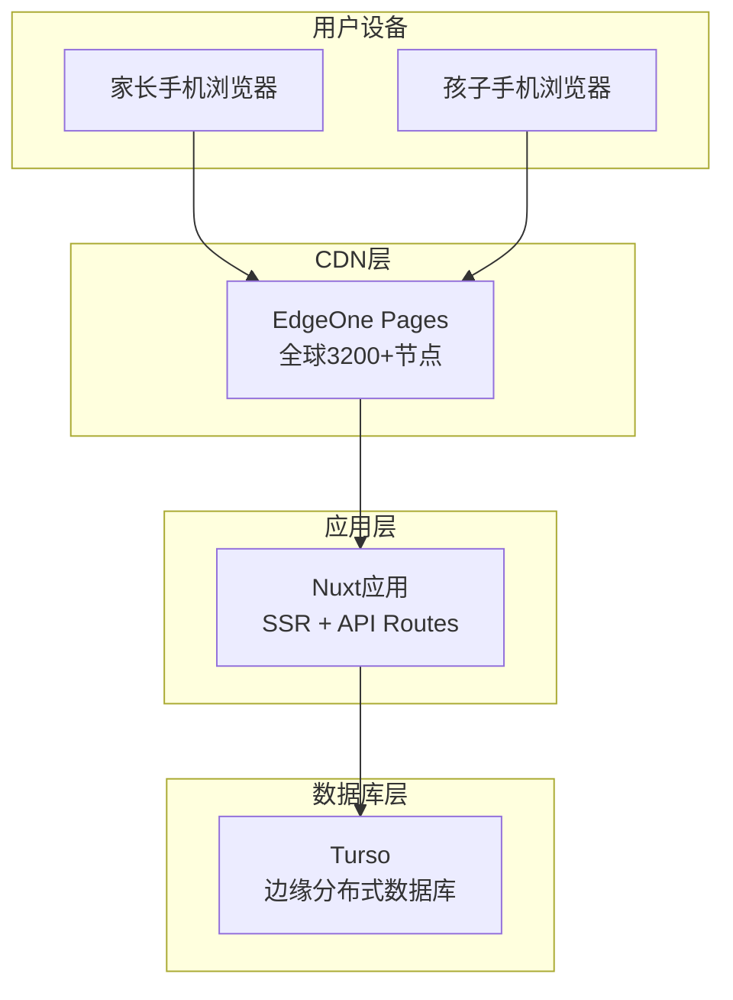
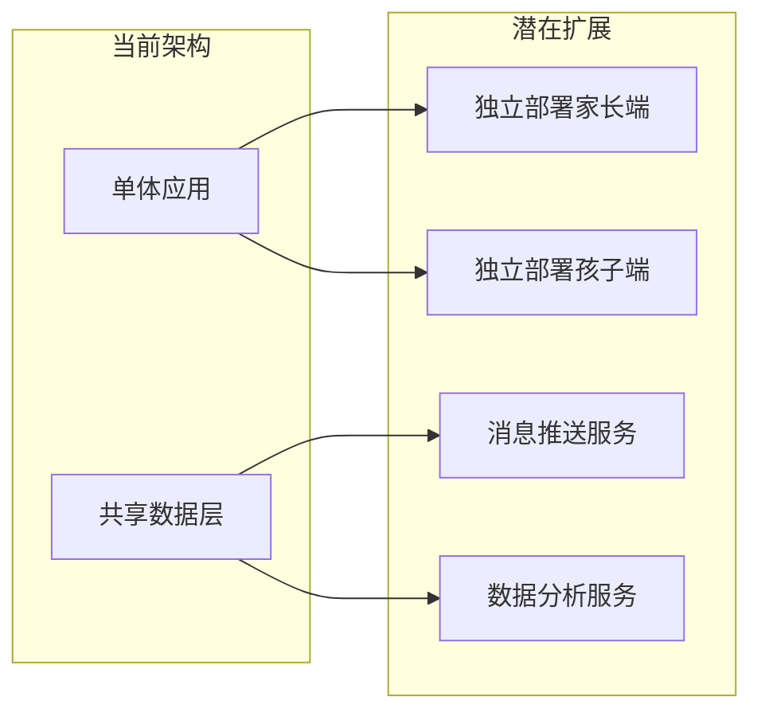

# 家庭积分兑换系统 - 架构设计

## 文档概览

本文档从业务和技术两个维度描述系统的整体架构，帮助开发团队理解系统结构，并为后续扩展提供指导。

| 章节 | 内容 |
|------|------|
| 1. 业务架构 | 领域模型、业务模块、业务流程 |
| 2. 技术架构 | 系统分层、部署架构、技术选型 |
| 3. 扩展规划 | 已识别的扩展点和未来功能 |

---

## 1. 业务架构

### 1.1 业务领域模型

#### 1.1.1 核心实体

| 实体 | 说明 | 核心属性 |
|------|------|---------|
| **Family** 家庭 | 系统的核心组织单位，所有数据以家庭为单位隔离 | id |
| **User** 用户 | 家庭成员，区分家长和孩子角色 | username, role, currentPoints, totalPoints |
| **Task** 任务 | 孩子可完成的日常任务，完成后获得积分 | name, points, description, categoryId |
| **Category** 类别 | 任务分类，由家长自定义 | name, order |
| **Gift** 礼物 | 孩子可用积分兑换的奖励 | name, points, color |
| **TaskCompletion** 完成记录 | 孩子完成任务的历史记录 | points(快照), completedAt, revokedAt |
| **GiftRedemption** 兑换记录 | 孩子兑换礼物的历史记录 | points(快照), status, confirmedAt |
| **ExchangeDay** 兑换日 | 每周允许兑换礼物的日期设置 | dayOfWeek |

#### 1.1.2 实体关系图



#### 1.1.3 设计要点

| 要点 | 说明 |
|------|------|
| **积分独立** | 每个孩子有独立的积分账户，互不影响 |
| **任务/礼物共用** | 家庭内所有孩子看到相同的任务池和礼物池 |
| **积分快照** | 完成记录和兑换记录存储当时的积分值，修改任务/礼物不影响历史 |
| **兑换状态** | 兑换需家长确认，状态流转：待确认 → 已确认/已撤销 |
| **数据隔离** | 不同家庭的数据完全隔离 |

---

### 1.2 业务模块划分

#### 1.2.1 模块结构图



#### 1.2.2 模块职责边界

| 模块 | 职责 | 输入 | 输出 | 操作者 |
|------|------|------|------|--------|
| **任务管理** | 创建/编辑/删除任务、管理类别 | 任务信息、类别信息 | 任务列表、类别列表 | 家长 |
| **礼物管理** | 创建/编辑/删除礼物 | 礼物信息 | 礼物列表 | 家长 |
| **成员管理** | 添加/删除家庭成员 | 用户信息 | 成员列表 | 家长 |
| **兑换日设置** | 设置每周兑换日 | 日期选择 | 兑换日配置 | 家长 |
| **统计查看** | 查看本周完成情况 | 无 | 完成统计表 | 家长 |
| **撤销操作** | 撤销完成记录/兑换记录 | 记录ID | 更新后的状态 | 家长 |
| **任务完成** | 完成任务获得积分 | 任务ID | 积分增加、完成记录 | 孩子 |
| **礼物兑换** | 用积分兑换礼物 | 礼物ID | 积分减少、兑换记录 | 孩子 |
| **积分查看** | 查看当前/累计积分 | 无 | 积分数据 | 孩子 |
| **历史查看** | 查看历史记录 | 无 | 完成/兑换历史 | 孩子 |
| **用户认证** | 登录/注册/登出 | 用户名+密码 | Session | 全部 |
| **家庭绑定** | 用户与家庭关联 | 无 | 家庭关系 | 系统 |
| **时间处理** | 时区转换、周期计算 | UTC时间 | 本地时间、周期边界 | 系统 |

#### 1.2.3 模块间依赖关系



---

### 1.3 业务流程总览

#### 1.3.1 核心业务流程



#### 1.3.2 任务完成流程



#### 1.3.3 礼物兑换流程



#### 1.3.4 家长撤销流程



---

## 2. 技术架构

### 2.1 系统分层架构

#### 2.1.1 分层结构图



#### 2.1.2 各层职责说明

| 层级 | 职责 | 技术实现 |
|------|------|---------|
| **前端层** | 页面渲染、用户交互、状态管理 | Nuxt 3 + Vue 3 + Tailwind CSS |
| **API层** | 接收请求、参数验证、权限检查、调用业务层 | Nuxt Server Routes + 中间件 |
| **业务层** | 业务逻辑处理、数据计算、事务管理 | TypeScript 服务函数 |
| **数据层** | 数据持久化、查询优化、连接管理 | Prisma + Turso |

#### 2.1.3 前端目录结构

```
apps/nuxt-app/
├── app/
│   ├── pages/
│   │   ├── parent/           # 家长端页面
│   │   │   ├── index.vue     # 统计页（首页）
│   │   │   ├── tasks.vue     # 任务管理页
│   │   │   ├── gifts.vue     # 礼物管理页
│   │   │   └── settings.vue  # 设置页
│   │   ├── child/            # 孩子端页面
│   │   │   ├── index.vue     # 任务页（首页）
│   │   │   ├── gifts.vue     # 礼物页
│   │   │   └── profile.vue   # 个人中心页
│   │   ├── login.vue         # 登录页
│   │   └── register.vue      # 注册页（家长）
│   ├── components/
│   │   ├── parent/           # 家长端组件
│   │   ├── child/            # 孩子端组件
│   │   └── shared/           # 共享组件
│   ├── layouts/
│   │   ├── parent.vue        # 家长端布局（含底部导航）
│   │   └── child.vue         # 孩子端布局（含底部导航）
│   └── composables/          # 共享逻辑
├── server/
│   ├── api/                  # REST API
│   ├── utils/                # 服务端工具函数
│   └── middleware/           # 认证中间件
├── prisma/
│   └── schema.prisma         # 数据模型
└── utils/                    # 共享类型定义
```

---

### 2.2 部署架构

#### 2.2.1 部署结构图



#### 2.2.2 部署配置说明

| 组件 | 平台 | 说明 |
|------|------|------|
| **应用托管** | EdgeOne Pages | 腾讯云边缘部署平台，支持 Nuxt 全栈应用 |
| **数据库** | Turso | 边缘分布式 SQLite，通过 HTTP 连接 |
| **CDN** | EdgeOne 内置 | 全球加速，自动缓存静态资源 |

#### 2.2.3 环境配置

| 环境 | 数据库 | 说明 |
|------|------|------|
| **开发环境** | 本地 SQLite | `dev.db` 文件，无需 Turso 连接 |
| **生产环境** | Turso | 配置 `TURSO_DATABASE_URL` + `TURSO_AUTH_TOKEN` |

---

### 2.3 技术选型理由

#### 2.3.1 核心技术栈

| 技术 | 选型理由 | 替代方案对比 |
|------|---------|-------------|
| **Nuxt 3** | SSR支持好、API Routes内置、部署简单 | Next.js：生态更大但 Vue 项目不适合 |
| **Vue 3 + Composition API** | 团队熟悉、响应式系统成熟、TypeScript友好 | React：生态更大但团队不熟悉 |
| **Tailwind CSS** | 开发效率高、无需维护CSS文件、响应式友好 | 传统CSS：需要维护样式文件，效率低 |
| **Prisma** | TypeScript友好、类型安全、迁移管理方便 | Drizzle：更轻量但生态不如Prisma成熟 |
| **Turso** | 边缘部署、与SQLite兼容、免费额度够用 | PostgreSQL：功能更强但部署复杂 |
| **bcrypt** | 密码加密行业标准、安全性高 | argon2：更现代但bcrypt更成熟稳定 |

#### 2.3.2 设计决策记录

| 决策 | 选择 | 原因 |
|------|------|------|
| **架构模式** | 单体应用双入口 | 两个端共享数据和后端，维护成本低 |
| **认证方式** | Session-based | Nuxt内置支持，比JWT更简单安全 |
| **时区处理** | 前端传递偏移量 | 用户可能在不同时区，需个性化处理 |
| **状态管理** | 无全局库 | 数据主要来自API，useFetch足够 |
| **表单验证** | 手写验证 | 表单简单，无需引入Zod等库 |

---

## 3. 扩展规划

### 3.1 已识别的扩展点

#### 3.1.1 架构扩展点



| 扩展点 | 当前状态 | 扩展方式 | 触发条件 |
|------|---------|---------|---------|
| **家长端独立部署** | 合并在单体应用 | 拆分为独立Nuxt应用 | 家长端功能复杂度显著高于孩子端 |
| **孩子端独立部署** | 合并在单体应用 | 拆分为独立Nuxt应用 | 需要独立优化孩子端性能 |
| **消息推送服务** | 无 | 新增独立服务 | 需要实时提醒功能（如任务到期提醒） |
| **数据分析服务** | 无 | 新增独立服务 | 需要长期数据分析和报表功能 |

#### 3.1.2 功能扩展点

| 功能 | 当前状态 | 扩展方式 | 预期收益 |
|------|---------|---------|---------|
| **任务模板** | 无 | 家长可保存任务模板，快速创建 | 减少重复创建任务的工作 |
| **积分历史明细** | 简单历史查看 | 增加积分变化明细列表 | 让孩子更清楚积分来源 |
| **连续完成奖励** | 无 | 连续多天完成任务额外奖励 | 增强激励效果 |
| **礼物库存** | 无库存概念 | 礼物有库存数量限制 | 更真实的兑换体验 |
| **任务有效期** | 无 | 任务可设置有效期 | 支持短期特殊任务 |
| **家长端推送** | 无 | 孩子完成/兑换时推送提醒 | 家长及时了解孩子动态 |

### 3.2 扩展优先级建议

| 优先级 | 功能 | 理由 |
|--------|------|------|
| **P1 高优先级** | 任务模板 | 家长高频操作，效率提升明显 |
| **P1 高优先级** | 积分历史明细 | 孩子端核心体验，增强透明度 |
| **P2 中优先级** | 连续完成奖励 | 增强激励机制，对行为养成有帮助 |
| **P2 中优先级** | 家长端推送 | 家长体验提升，需新增推送服务 |
| **P3 低优先级** | 礼物库存 | 当前简化模型够用，复杂度增加明显 |
| **P3 低优先级** | 任务有效期 | 使用场景有限，可延后考虑 |

---

## 附录：术语表

| 术语 | 说明 |
|------|------|
| **家庭** | 系统的核心组织单位，数据以家庭为单位隔离 |
| **积分快照** | 完成记录/兑换记录中存储当时的积分值，不受后续修改影响 |
| **兑换日** | 每周允许兑换礼物的日期，由家长设置 |
| **本周** | 定义为周一至周日，从周一开始 |
| **待确认兑换** | 孩子兑换后等待家长确认的状态 |
| **关联撤销** | 撤销完成记录时积分不足，系统自动撤销待确认兑换记录以返还积分 |

---

**文档版本：** v1.0  
**创建日期：** 2026-05-21  
**讨论参与：** 用户与 Claude Code  
**关联文档：** [[2026-05-21-family-mechanism-design]]、[[2026-05-21-parent-app-design]]、[[2026-05-21-child-daily-flow-design]]、[[2026-05-21-tech-stack-design]]